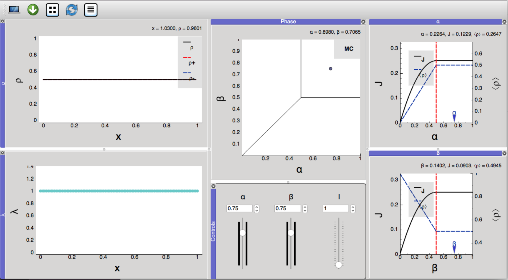

# EGGTART
EGGTART (**E**xtensive **G**UI **g**ives **T**ASEP-realization in **r**eal-**t**ime) is a software package that provides a visualization of the dynamics associated with the generalized Totally Asymmetric Simple Exclusion Process (TASEP).

## Installation
EGGTART has been developed in Python 3.6. It uses the packages numpy and pyqtgraph, which require pyqt4 or pyqt5. For ease of installation, we provide an executable version of the software that does not require having Python and the required add-on packages installed. To launch EGGTART, simply download the version developed for your operating system, and double-click the corresponding executable file. A separate open-source version will be made available in the future. We provide different versions of EGGTART for Mac OS X, Linux (Ubuntu 18.04) and Windows, with most extensive testing conducted on Mac.

## Tutorial
Here is a simple tutorial to demonstrate the various features of EGGTART and the fundamental properties of the TASEP:

1. To begin with, let us visualize the original TASEP model. Load the input file called 
```
homogeneous\_rates.csv
```


Please consult the user manual "EGGTART_User_Manual.pdf" for further details.
  
Dan D. Erdmann-Pham, UC Berkeley\
Wonjun Son, Columbia University\
Khanh Dao Duc, University of British Columbia\
Yun S. Song, UC Berkeley
